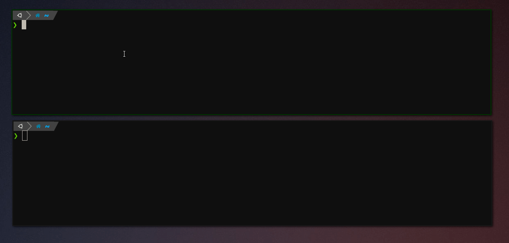

# Lambo

<p align="center">
	
</p>

Test API Gateway wrapped lambda functions locally.

Lambo can also be used to test API GW lambdas in CI without needing docker-in-docker.

<p align="center">
	
</p>


## Usage

### Binary

```bash
lambo --listen-addr 127.0.0.1:3000 ./my-lambda
```

### Docker

```bash
docker run -it -v `pwd`:/app ghcr.io/liamg/lambo:latest /app/my-lambda
```

